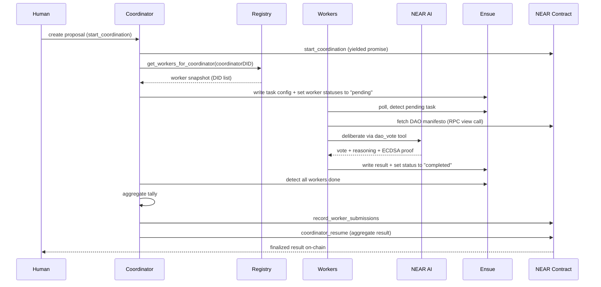

# Voting Flow (E2E)

A complete walkthrough of how a governance proposal moves from creation to on-chain settlement.

## Sequence overview



## Step-by-step breakdown

### 1. Proposal creation

A human (or automation) triggers a proposal via the coordinator API or the NEAR contract directly:

```bash
curl -X POST http://localhost:3000/api/coordinate/trigger \
  -H 'Content-Type: application/json' \
  -d '{
    "taskConfig": {
      "type": "vote",
      "parameters": {
        "proposal": "Fund a developer education program",
        "voting_config": { "min_workers": 2, "quorum": 2 }
      }
    }
  }'
```

The coordinator calls `start_coordination` on the NEAR contract, which creates a **yielded promise** with a ~200 block timeout (~100 seconds on testnet).

### 2. Worker discovery

The coordinator queries the registry contract:

```
get_workers_for_coordinator(coordinatorDID)
```

This returns all registered workers for that coordinator. The coordinator takes a **snapshot** of the DID list -- only these workers participate in this proposal.

### 3. Task dispatch via Ensue

The coordinator does **not** HTTP-call workers directly. Instead, it:

1. Writes the task config to Ensue: `coordination/config/task_definition`
2. Sets each snapshotted worker's status to `pending`: `coordination/tasks/{workerDID}/status`

Workers independently poll Ensue every 3 seconds and detect the pending task.

<Callout type="info">
  This polling model is required for Phala TEE deployments where the coordinator cannot make outbound HTTP calls to workers.
</Callout>

### 4. AI deliberation

Each worker independently:

1. Fetches the DAO manifesto from the coordinator contract (RPC view call)
2. Loads its persistent memory from Ensue (accumulated knowledge, preferences, past decisions)
3. Calls NEAR AI (DeepSeek-V3.1) with the `dao_vote` tool
4. Receives a structured vote (Approved/Rejected) with reasoning

### 5. Vote submission

Each worker writes its result to Ensue:

- `coordination/tasks/{workerDID}/result` -- contains `{ vote, reasoning }`
- `coordination/tasks/{workerDID}/status` -- set to `completed`

The worker also retrieves an **ECDSA verification proof** from NEAR AI:

```
GET /v1/signature/{chat_id}
```

This proof attests that the AI model produced the specific vote output.

### 6. Aggregation

The coordinator monitors Ensue for worker completions. Once all snapshotted workers finish (or the 120-second timeout expires with quorum met):

1. Reads all votes from Ensue
2. Tallies Approved vs Rejected
3. Determines the final decision

### 7. On-chain settlement

The coordinator makes two contract calls:

1. **`record_worker_submissions`** -- records the worker count (count check, not per-ID validation)
2. **`coordinator_resume`** -- submits only the aggregate: `{ approved, rejected, decision, workerCount }`

The contract validates the count, resumes the yielded promise, and stores the finalized result.

## Privacy model

| Data | Location | Visibility |
|---|---|---|
| Individual votes + reasoning | Ensue (AES-256-GCM encrypted) | Worker + coordinator only |
| AI verification proofs | Ensue | Worker + coordinator only |
| Aggregate tally | NEAR contract | Public (on-chain) |
| Worker identities | NEAR registry | Public (on-chain) |

<Callout type="warning">
  Individual reasoning never goes on-chain. Only the aggregate vote count and decision are published.
</Callout>

## Quorum configuration

Each proposal can override the default quorum settings:

```json
{
  "voting_config": {
    "min_workers": 2,
    "quorum": 2
  }
}
```

- **min_workers** -- minimum workers that must be registered before the proposal is accepted
- **quorum** -- minimum votes needed to finalize the result

## Verification

Every vote includes a NEAR AI signature proof tied to a `chat_id`. This ECDSA-signed attestation proves the AI model produced the specific output, providing an auditable trail without revealing individual votes publicly.
